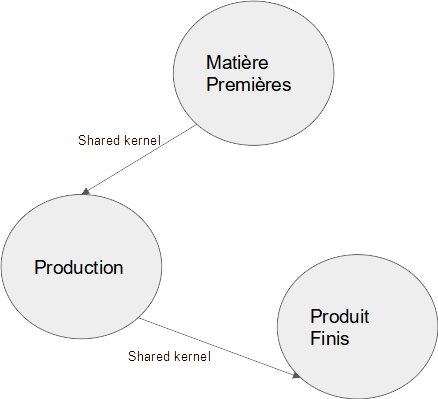

# Quality control application for soft drinks, designed with functional DDD

## Documentation

 _Contrôle Qualité sur produit en cours de production: Contrôle du remplissage_ 

 _Contrôle Qualité sur produit en cours de production: Contrôle de l’étiquetage_ 

 _Contrôle Qualité sur produit en cours de production: Contrôle du fardelage_ 

 _Contrôle des échantillons prélevés_ 

 _Contrôle qualité sur matière premières: Recherche de contaminants_ 

 _Contrôle qualité sur matière premières: Analyse des arômes_ 

 _Contrôle qualité sur matière premières: Recherche d’additifs_ 

 _Contrôle Qualité sur produit finis: Contrôle en bout de ligne_ 

 _Contrôle Qualité sur produit finis: Caractérisation des produits ou matériaux en contact avec la boisson au cours de sa fabrication_ 

Workflow: Contrôle d’une étape de production

Process: Contrôle d’une étape de production

Process: Contrôle d’une étape de production 

Workflow: Entrer séquentiellement chaque résultat de control suivant le plan de contrôle

Business rules \(integrity\)

Pour chaque contrôle du plan de contrôle\, tous les éléments de l'échantillon doivent être analysés et les résultats enregistrés

Process: Contrôle d’une étape de production 

